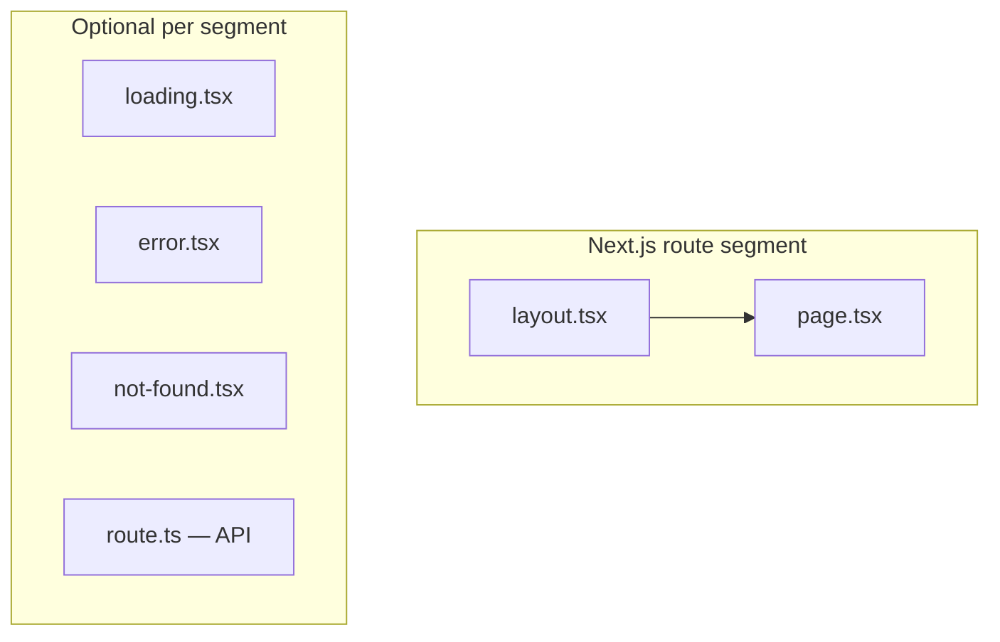
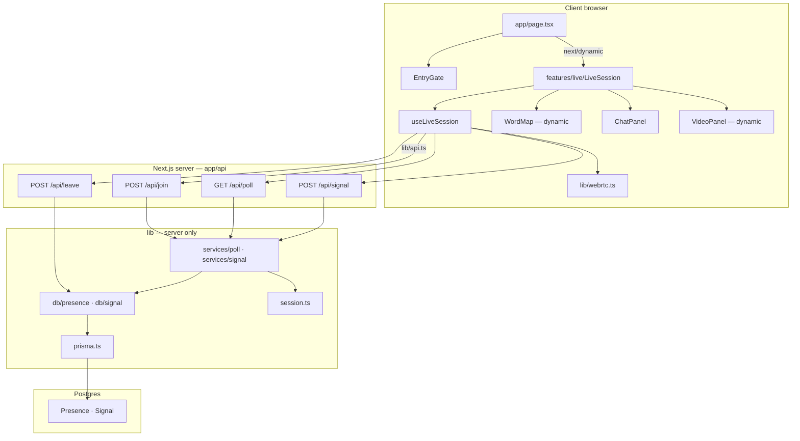
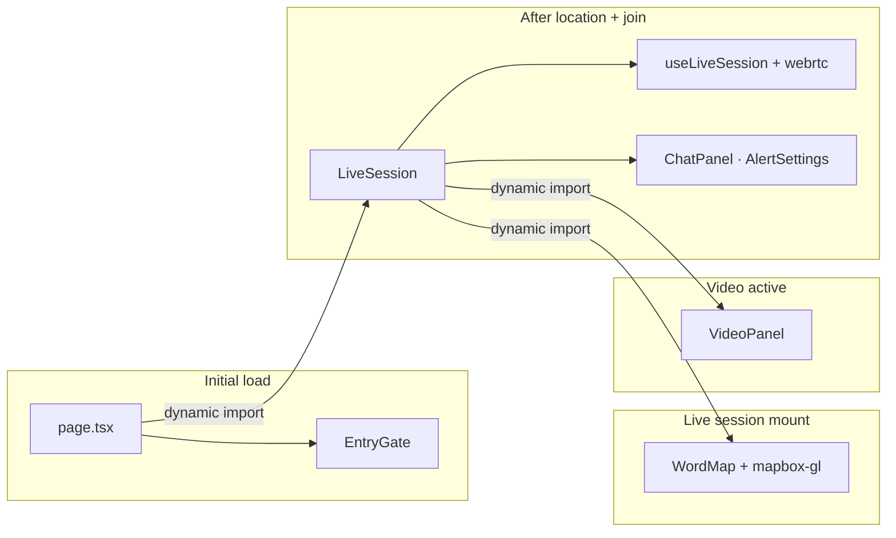
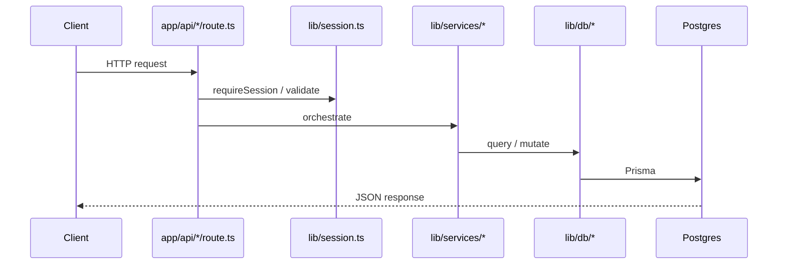

# Project structure

This document describes how **Pulse** is organized on top of the [Next.js App Router project structure](https://nextjs.org/docs/app/getting-started/project-structure).

Pulse follows the recommended pattern of keeping **`app/` for routing** and storing shared application code in **top-level folders outside `app`**.

---

## Next.js baseline

Next.js defines special folders and file conventions. The tables below are a condensed reference; see the [official docs](https://nextjs.org/docs/app/getting-started/project-structure) for the full guide.

### Top-level folders

| Folder | Purpose |
|--------|---------|
| `app/` | App Router — routes, layouts, API handlers |
| `pages/` | Pages Router (legacy; not used in Pulse) |
| `public/` | Static assets served at `/` |
| `src/` | Optional wrapper for `app/` (not used in Pulse) |

### Routing files (inside `app/`)

| File | Role |
|------|------|
| `layout.tsx` | Shared UI wrapper for a segment and its children |
| `page.tsx` | Public UI for a URL segment |
| `route.ts` | API endpoint (HTTP handlers) |
| `loading.tsx` | Suspense loading UI |
| `error.tsx` | Error boundary UI |
| `not-found.tsx` | 404 UI |

A folder becomes a **public route** only when it contains `page.tsx` or `route.ts`. Other files colocated in `app/` are not routable by default.

### Organization strategies (from Next.js)

Next.js is unopinionated about colocation. Common patterns:

1. **Outside `app`** — shared `components/`, `lib/`, `features/` at the project root; `app/` stays thin.
2. **Inside `app`** — everything under `app/components`, `app/lib`, etc.
3. **By feature** — global shared code at root, feature-specific code next to the routes that use it.

Pulse uses **strategy 1 + feature modules**: global UI in `components/`, shared logic in `lib/`, and the live-session feature in `features/live/`.

### Next.js component hierarchy

For nested routes, special files render in this order (outer → inner):

```
layout → template → error → loading → not-found → page
```

Pulse currently has a single route (`/`) with `app/layout.tsx` wrapping `app/page.tsx`.



---

## Pulse repository layout

```text
Pulse-Technical-Assessment/
├── app/                        # Routes & route-local UI
│   ├── layout.tsx              # Root layout (fonts, metadata, globals)
│   ├── page.tsx                # / — thin gate → live orchestrator
│   ├── globals.css             # Global styles & component animations
│   ├── components/
│   │   └── EntryGate.tsx       # Onboarding / location gate (initial bundle)
│   └── api/                    # Coordination API (server)
│       ├── join/route.ts       # POST — register presence
│       ├── leave/route.ts      # POST — remove presence
│       ├── poll/route.ts       # GET  — heartbeat + peer list + signals
│       └── signal/route.ts     # POST — relay WebRTC / connection signals
│
├── features/                   # Feature modules (outside app routing)
│   └── live/
│       ├── LiveSession.tsx     # Live map UI shell
│       ├── useLiveSession.ts   # Polling, WebRTC, connection state
│       ├── types.ts              # Conn, VideoState, Location
│       ├── LiveLoadingShell.tsx
│       └── components/           # Live-only overlays
│           ├── ConnectionPrompt.tsx
│           ├── RequestingBanner.tsx
│           └── VideoWaitingBanner.tsx
│
├── components/                 # Shared UI (not routable)
│   ├── ui/                     # Primitives (Button, Icons, AlertSettings)
│   └── templates/              # Feature-sized templates
│       ├── WordMap.tsx         # Mapbox globe (heavy — code-split)
│       ├── ChatPanel.tsx
│       └── VideoPanel.tsx
│
├── lib/                        # Shared application logic
│   ├── api.ts                  # Client fetch helpers (join, poll, signal, leave)
│   ├── webrtc.ts               # PeerSession — P2P chat & video
│   ├── alerts.ts               # Sounds & desktop notifications
│   ├── session.ts              # Per-tab session token auth
│   ├── rate-limit.ts           # In-memory API rate limits
│   ├── types.ts                # Shared client + API types
│   ├── presence.ts             # Poll interval constants
│   ├── geo.ts                  # Location offset helpers
│   ├── prisma.ts               # Prisma client singleton
│   ├── db/                     # Data access (Prisma only)
│   │   ├── presence.ts
│   │   └── signal.ts
│   ├── services/               # API orchestration & policy
│   │   ├── poll.ts
│   │   └── signal.ts
│   └── utils/
│       └── signal.ts           # Request body parsing & validation
│
├── prisma/
│   └── schema.prisma           # Presence + Signal tables
│
├── docs/                       # Project documentation
│   ├── requirements.md
│   └── project-structure.md    # This file
│
├── next.config.ts
├── prisma.config.ts
├── tsconfig.json               # `@/*` → project root
├── package.json
├── NOTES.md                    # Implementation journal (phases 1–4)
└── AGENTS.md                   # Agent / Next.js version notes
```

### What Pulse uses vs. skips

| Next.js convention | Pulse usage |
|--------------------|-------------|
| `app/page.tsx` | Single page at `/` |
| `app/layout.tsx` | Root layout with Geist fonts + metadata |
| `app/api/**/route.ts` | Four coordination endpoints |
| `loading.tsx` / `error.tsx` | Not used — loading handled via `next/dynamic` |
| Route groups `(group)` | Not used — single-page flow |
| Private folders `_folder` | Not used — features live outside `app/` |
| `src/` folder | Not used |
| `pages/` router | Not used |

---

## Architecture diagram

High-level separation of concerns:



---

## Client code-splitting

The home route deliberately keeps the **initial bundle small**. Heavy code loads only when needed.



| Boundary | Mechanism | What loads |
|----------|-----------|------------|
| Gate → live | `next/dynamic` in `app/page.tsx` | `features/live/*`, WebRTC, chat |
| Live → map | `next/dynamic` in `LiveSession.tsx` | `mapbox-gl`, `WordMap` |
| Live → video | `next/dynamic` + conditional render | `VideoPanel` |

---

## API layer (thin routes)

Route handlers authenticate, rate-limit, and delegate to services. Business rules live in `lib/services/`, Prisma calls in `lib/db/`.



| Endpoint | Handler | Service / DB |
|----------|---------|--------------|
| `POST /api/join` | `app/api/join/route.ts` | `presenceDb.upsertOnJoin` |
| `GET /api/poll` | `app/api/poll/route.ts` | `getPollResponse` |
| `POST /api/signal` | `app/api/signal/route.ts` | `deliverSignal` |
| `POST /api/leave` | `app/api/leave/route.ts` | `presenceDb` cleanup |

---

## Import aliases

`tsconfig.json` maps `@/*` to the project root:

```ts
import LiveSession from "@/features/live/LiveSession";
import { join } from "@/lib/api";
import ChatPanel from "@/components/templates/ChatPanel";
```

---

## Where to add new code

| You are building… | Put it in… |
|-------------------|------------|
| A new page or URL | `app/<segment>/page.tsx` |
| A new API endpoint | `app/api/<name>/route.ts` → delegate to `lib/services/` |
| Live-session UI or logic | `features/live/` |
| Reusable button, icon, settings | `components/ui/` |
| Large feature template (map, chat shell) | `components/templates/` |
| Gate / route-local UI | `app/components/` |
| DB queries | `lib/db/` |
| API business rules | `lib/services/` |
| Client ↔ server fetch helpers | `lib/api.ts` |
| Shared types | `lib/types.ts` (domain) or `features/*/types.ts` (feature-local) |

---

## Related docs

- [Next.js project structure](https://nextjs.org/docs/app/getting-started/project-structure) — framework baseline
- [docs/requirements.md](./requirements.md) — product requirements
- [NOTES.md](../NOTES.md) — implementation history (security, UI, API refactor, code-splitting)
